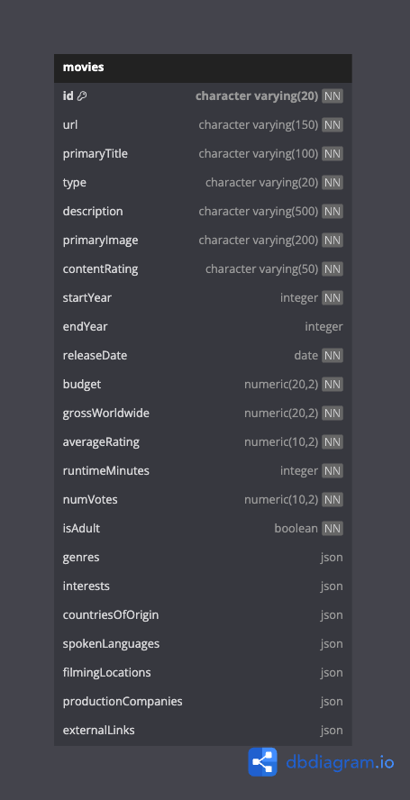
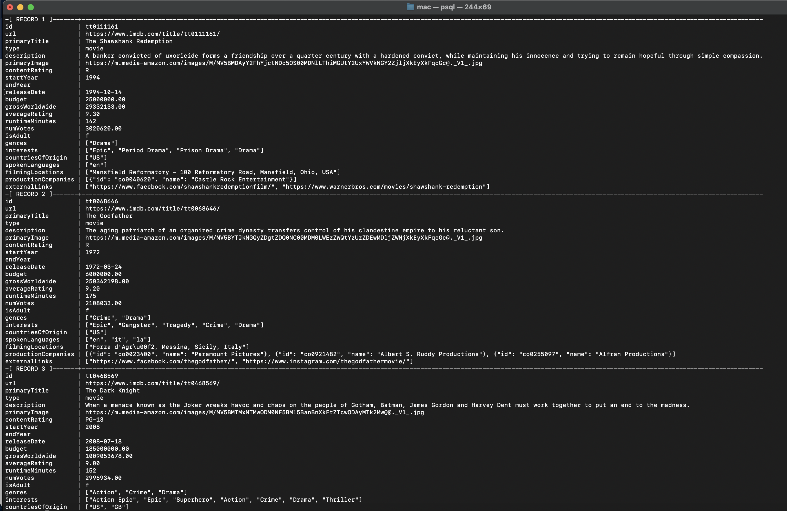

# Damilola ETL Pipeline

## Overview
This project implements an ETL (Extract, Transform, Load) pipeline to process movie data from the IMDB API (via RapidAPI). It efficiently extracts raw data, processes it for analysis, and stores it in a structured database format.
## Features
- Extract: Fetch movie data from the IMDB API using RapidAPI.
- Transform: Clean and transform the extracted data using `Polars` (or optionally Pandas) for efficient processing.
- Database integration with `SQLAlchemy` and `psycopg2`
- Configuration management using `.env` files
- Unit testing with `pytest`
   ```
## Database table schema
This is my table schema



## Project Structure
```
/etl_pipeline
│── .env                # Environment variables
│── .gitignore          # Git ignore file
│── pyproject.toml      # Project dependencies and metadata
│── poetry.lock         # Dependency lock file
│── README.md           # Project documentation
│── src/
│   ├── __init__.py     # Package initialization
│   ├── web_scraper.py      # Extraction logic
│   ├── data_transform.py    # Data transformation logic
│   ├── db_loader.py         # Load processed data into a database
│   ├── model.py         # SQL alchemy model
│── scripts/
│   ├── __init__.py     # Package initialization
│   ├── run_pipeline.py      # run etl pipeline logic
│── utils/
│   ├── __init__.py     # Package initialization
│   ├── config.py      # load env variable to python
│   ├── utils.py      # general utility functions
│── tests/
│   ├── __init__.py     # Package initialization
│   ├── test_web_scraper.py # Unit tests for extraction
│   ├── test_data_transform.py # Unit tests for transformation
│   ├── test_db_loader.py    # Unit tests for loading
│   ├── conftest.py    # Unit tests for loading
```
## Result



## Installation
### Prerequisites
- Python 3.13+
- Poetry package manager

### Steps
1. Clone the repository:
   ```sh
   git clone <repository_url>
   cd etl_pipeline
   ```
2. Install dependencies:
   ```sh
   poetry install
   ```
3. Create a `.env` file based on `.env.example` and configure database settings.

## Usage
Run the ETL pipeline with:
```sh
python main.py
```

To run tests:
```sh
pytest
```

## Dependencies
- `polars` (>=1.25.2,<2.0.0)
- `python-dotenv` (>=1.0.1,<2.0.0)
- `sqlalchemy` (>=2.0.39,<3.0.0)
- `psycopg2` (>=2.9.10,<3.0.0)
- `pytest` (>=8.3.5,<9.0.0)

## Author
**Damilola Adeniyi**


